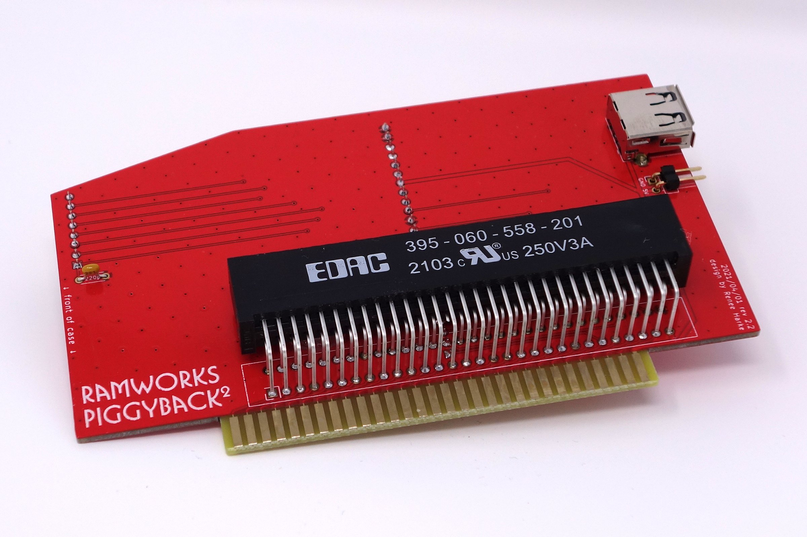
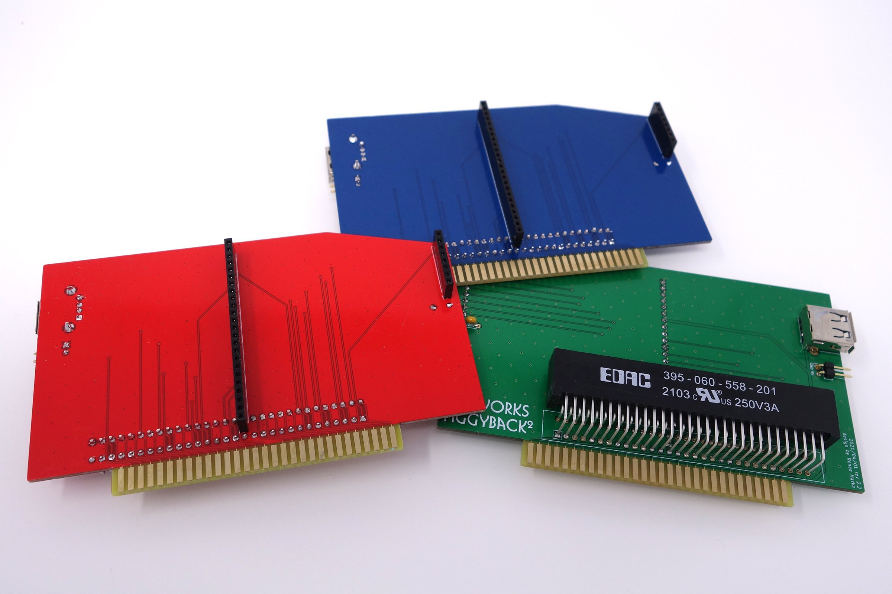

# RamWorks Piggyback²

This card provides a way to use a modern Apple IIe RAM card (such as the GW4203B from Garret's Workshop) with a RamWorks-style RGB piggyback card.

For the RGB piggyback, it is compatible with classic piggyback cards like the Applied Engineering RGB Card, Digital Prism, and Color Link, as well as the a2heaven VGA piggyback card.

For the RAM, the GW4203B is recommended, but you could also use one of the older GW 2MB cards, or one of the "small" Apple 80-column cards. (But why?) It just needs to be 2" tall or less.

You can optionally install a USB port and/or a 2-pin header to allow a convenient way to tap 5V power for other peripherals, such as a WiModem232.

A 220pF capacitor (exact value probably doesn't matter much) may be installed (and is recommended). This provides some filtering on the FRCTXT line, which is involved in flipping between DHGR modes. Without it, it has been reported that sometimes an attached Digital Prism will erroneously flip from DHGR mono back into DHGR color at random intervals. Not all cards/computers seem to demonstrate this issue, but the capacitor shouldn't hurt anything.

## Shop

I sell these cards in my [shop](http://lexingtoninfosystems.com).

Since this project is MIT licensed, please feel free to build your own if you like! Note however that the 60-pin edge connectors often have to be purchased in bulk.

## Photos

## Bill of Materials

* 60-pin 0.1" pin / 0.2" row right-angle female edge connector (suggested: [EDAC 	
395-060-558-201](https://www.digikey.com/en/products/detail/edac-inc/395-060-558-201/10885109))
* 24-pin 0.1" female header (suggested: [Sullins PPPC241LFBN-RC](https://www.digikey.com/en/products/detail/sullins-connector-solutions/PPPC241LFBN-RC/810196))
* 8-pin 0.1" female header (suggested: [Sullins PPPC081LFBN-RC](https://www.digikey.com/product-detail/en/sullins-connector-solutions/PPPC081LFBN-RC/S7041-ND/810180))
* 2x 0.5" rubber bumper (suggesteD: [3M Bumpon SJ6512](https://www.digikey.com/en/products/detail/3m/SJ6512/3866123))
* Optional: USB-A female receptacle (suggested: [Stewart SS-52100-001](https://www.digikey.com/en/products/detail/stewart-connector/SS-52100-001/7902377))
* Optional: 2-pin 0.1" right angle male header (suggested: [Sullins PRPC002SBAN-M71RC](https://www.digikey.com/en/products/detail/sullins-connector-solutions/PRPC002SBAN-M71RC/2775332))
* Optional: 220pF 0.2" ceramic capacitor (suggested: [KEMET C322C221K1G5TA](https://www.digikey.com/en/products/detail/kemet/C322C221K1G5TA/3726159))

## Assembly

You can use the gerbers in `rw-piggyback-gerbers.zip` to have the PCB manufactured at the FAB of your choice.

* Insert and solder the 8-pin and the 24-pin female headers to the BACK of the PCB. You MUST do this first, before you solder in the edge connector.
* Cut off pin 47 from the edge connector, as close to the plastic as you can. You can tell which pin is 47 by holding the connector up to the PCB. It is the one in the position that crosses over with the 24-pin female header. You won't be able to insert the connector into the PCB until you cut the pin, because the 24-pin female header is occupying that position.
* Please 2 rubber bumpers in the circles indicated on the FRONT of the PCB.
* Insert the 60-pin edge connector into the FRONT of the PCB, using the rubber bumpers to ensure proper spacing from the PCB. Try to keep it straight, and solder it in place.
* Solder in the USB receptable, the 2-pin header, and the capacitor to the FRONT of the PCB.
